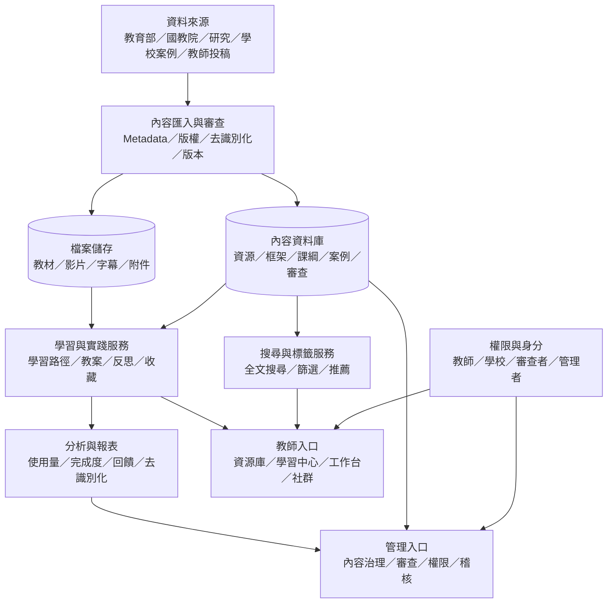

# SEL 平台：MVP 系統架構圖

## 一、邏輯架構

## 二、MVP 元件建議

| 元件 | MVP 作法 | 後續擴充 |
|---|---|---|
| 前端 | 響應式 Web | 行動 App、離線閱讀、無障礙增強 |
| API | REST 或 GraphQL，統一資源、帳號、學習紀錄介面 | 對接研習、課程與校務系統 |
| 內容資料庫 | 關聯式資料庫，保存結構化欄位與審查狀態 | 知識圖譜、語意搜尋 |
| 檔案儲存 | 物件儲存，檔案與 metadata 分離 | 影音轉碼、字幕、預覽 |
| 搜尋 | 全文索引＋結構化篩選 | 語意搜尋與個人化推薦 |
| 身分 | 平台帳號，預留教育單一登入 | 統一認證與研習時數同步 |
| 分析 | 事件紀錄＋彙整報表 | 學習分析與校本儀表板 |
| 監控 | 應用程式錯誤、效能、備份、稽核 | SLA、異常偵測與成本監控 |

## 三、資料流與安全邊界

1. 公開內容、教師學習紀錄、學校彙整資料與研究／個案資料分區保存。
2. 教師學習資料只能由本人與授權管理者依目的存取。
3. 學生個別資料不進入一般資源庫；若研究必要，使用獨立資料集、代碼化識別與額外審查。
4. 檔案下載須檢查授權狀態並留下稽核紀錄。
5. 所有內容變更產生新版本，保留作者、審查者與時間。

## 四、建置順序

### 第 0 期：需求與試點（4–6 週）

- 訪談教師、輔導、行政、師培與資料治理人員。
- 選定 2–3 個高需求情境。
- 建立 100 筆示範資源與審查規準。
- 確定個資、版權與帳號策略。

### 第 1 期：MVP（8–12 週）

- 資源目錄、搜尋篩選、帳號權限、學習路徑、教案工作台、反思、審查後台。
- 以 3–5 所試點學校進行可用性測試。

### 第 2 期：擴充（3–6 個月）

- 校本方案、社群共備、案例庫、去識別化儀表板、研習整合、無障礙與行動版。

## 五、架構決策原則

- 先把 metadata、授權、版本與審查流程做好，再擴大內容量。
- 內容模型與搜尋介面分離，避免未來更換技術時重建資料。
- 用最小必要資料支援專業發展，不建立未來可能被濫用的個人心理資料庫。
- 所有成效指標用於改善資源與支持教師，不作為教師排名工具。

